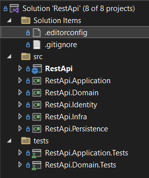

# dotnet-ef-restapi-template

# Usage

```powershell
git clone https://github.com/moisesduartem/dotnet-ef-restapi-template restapi/

dotnet new --install restapi/ # install the template according to .template.config/template.json

dotnet new restapi -o MyApp # create a new restapi solution for MyApp
```

# Technologies

## Database

The relational database used to create this template was **Microsoft SQL Server 2019**

## .NET Version

.NET 6.0.400

## Packages

- Unit testing - **MSTest**
    - [https://docs.microsoft.com/en-us/dotnet/core/testing/unit-testing-with-mstest](https://docs.microsoft.com/en-us/dotnet/core/testing/unit-testing-with-mstest)
- Object-Relational Mapper - **Entity Framework Core 6.0.8**
    - [https://docs.microsoft.com/en-us/ef/core/](https://docs.microsoft.com/en-us/ef/core/)
- Log library - **Serilog**
    - [https://serilog.net/](https://serilog.net/)
- Authentication manager - **Identity**
    - [https://docs.microsoft.com/en-us/aspnet/core/security/authentication/identity?view=aspnetcore-6.0](https://docs.microsoft.com/en-us/aspnet/core/security/authentication/identity?view=aspnetcore-6.0)
- Email sender - **FluentEmail**
    - [https://github.com/lukencode/FluentEmail](https://github.com/lukencode/FluentEmail)
- Fail fast validations - **Fluent Validation**
    - [https://fluentvalidation.net/](https://fluentvalidation.net/)
- Mediator implementation - **MediatR**
    - [https://github.com/jbogard/MediatR](https://github.com/jbogard/MediatR)
- Object mapper - **AutoMapper**
    - [https://automapper.org/](https://automapper.org/)

# Features

These are the endpoints implemented in this API:

- Sign in
- Sign up
- Forgot password
- Reset password
- Confirm email
- Get logged user profile
- Verify if the logged user is admin
- Verify if the user is Authorized

# Solution

The .NET solution is structured according to the picture below


